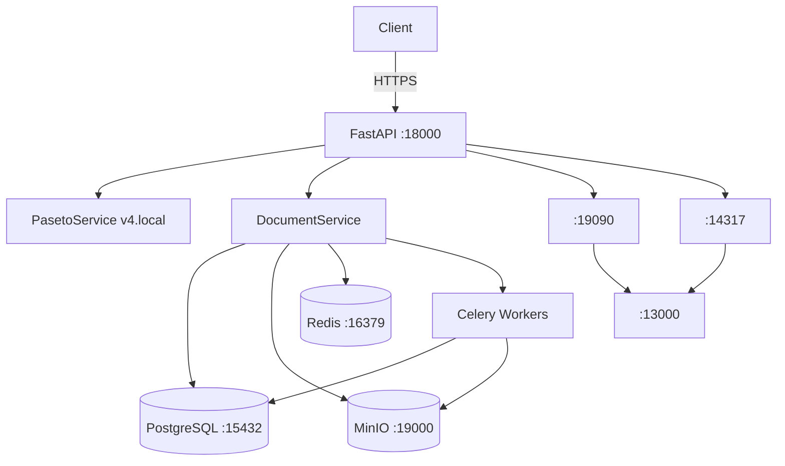

# SecureDocVault Enterprise Archive

Self-hosted, legal-grade document vault for Russian legal entities. Built for the kind of compliance that auditors actually respect — not just a checkbox exercise.

---

## What this is

A FastAPI backend that lets you:

- **Upload** legal documents (PDF, DOCX, TXT, images) with automatic envelope encryption
- **Verify** Russian KEP/NEP electronic signatures (CMS/PKCS#7)
- **Enforce** retention policies (COMPLIANCE / GOVERNANCE modes) and legal holds (WORM-style)
- **Share** documents via time-limited, download-capped links (with optional diagonal watermarks)
- **Audit** everything — every action produces a tamper-evident HMAC-SHA256 chain event
- **Observe** everything else — Prometheus metrics, OpenTelemetry traces → Grafana Tempo, structured JSON logs via structlog

Clean Architecture + DDD, no shortcuts. The domain layer has zero imports from SQLAlchemy or FastAPI. If you need to swap Postgres for something else, only the infrastructure layer breaks a sweat.

---

## Architecture at a glance

```
src/
├── core/           # Settings, logging, PASETO service, OTel bootstrap, DI container
├── domain/         # Entities, value objects, repository ABCs, domain exceptions
├── infrastructure/ # SQLAlchemy models, repos, MinIO, Redis, Celery tasks, crypto
├── application/    # Use cases (DocumentService, AuthService) + Pydantic DTOs
└── presentation/   # FastAPI routers, middleware, exception handlers
```



---

## Quick start

### Prerequisites

- Docker + Docker Compose (v2)
- `make` (Git Bash or WSL on Windows)
- Python 3.12+ (for running tests locally)

### Go

```bash
git clone <this-repo>
cd securedocvault-enterprise-archive

make setup   # copy .env.example → .env, build images, run migrations, seed demo users
make up      # start all services in background
make test    # run the test suite
```

Open [http://localhost:18000/docs](http://localhost:18000/docs) for Swagger UI.

Grafana at [http://localhost:13000](http://localhost:13000) (admin/admin).

---

## Non-standard ports (intentional)

| Service | Port |
|---------|------|
| API | **18000** |
| PostgreSQL | **15432** |
| Redis | **16379** |
| MinIO API | **19000** |
| MinIO Console | **19001** |
| Flower (Celery) | **15555** |
| Prometheus | **19090** |
| Grafana | **13000** |
| Tempo OTLP | **14317** |
| Loki | **13100** |

Standard ports are for devs who haven't broken anything yet.

---

## API overview

All endpoints under `/api/v1/`. Token auth via `Authorization: Bearer <paseto-token>`.

| Method | Path | Role | Description |
|--------|------|------|-------------|
| POST | `/auth/login` | — | Exchange credentials for PASETO token |
| GET | `/auth/me` | viewer+ | Current user info |
| POST | `/documents/` | archivist+ | Upload document |
| GET | `/documents/` | viewer+ | List documents (paginated) |
| GET | `/documents/{id}` | viewer+ | Get document metadata |
| POST | `/documents/{id}/download` | viewer+ | Download decrypted bytes |
| DELETE | `/documents/{id}` | archivist+ | Soft delete |
| POST | `/documents/{id}/restore` | admin+ | Restore deleted |
| POST | `/documents/{id}/versions/{vid}/verify-signature` | auditor+ | Verify CEP/NEP |
| POST | `/shares/{doc_id}` | archivist+ | Create share link |
| POST | `/shares/{id}/revoke` | archivist+ | Revoke link |
| POST | `/shares/public/{token}/download` | — | Public download |
| GET/POST | `/retention/...` | admin+ | Retention policies |
| GET/POST | `/legal-holds/...` | admin+ | Legal holds |
| GET | `/audit/documents/{id}/timeline` | auditor+ | Audit timeline |
| GET | `/health/live` | — | Liveness probe |
| GET | `/health/ready` | — | Readiness probe |
| GET | `/health/metrics` | — | Prometheus metrics |

---

## Demo users (seeded by `make setup`)

| Email | Password | Role |
|-------|----------|------|
| superadmin@demo.local | Demo1234! | super_admin |
| admin@demo.local | Demo1234! | admin |
| archivist@demo.local | Demo1234! | archivist |
| auditor@demo.local | Demo1234! | auditor |
| viewer@demo.local | Demo1234! | viewer |

---

## Dev workflow

```bash
make up       # start stack
make logs     # tail all service logs
make shell    # bash into api container
make migrate  # run alembic upgrade head
make seed     # re-seed demo users
make down     # stop everything
make clean    # stop + remove volumes (⚠️ nukes data)
```

### Running tests locally (without full Docker stack)

```bash
python -m venv .venv && source .venv/bin/activate  # or .venv\Scripts\activate on Windows
pip install -e ".[dev]"
pytest tests/unit/ -v                              # no external deps
pytest tests/e2e/ -v                               # needs running API (make up)
pytest tests/integration/ --integration            # needs Postgres + Redis
```

---

## Key design decisions

**PASETO v4 local instead of JWT** — eliminates algorithm confusion attacks (HS256/RS256 mixup), no JWKS endpoint to maintain, symmetric encryption fits our single-tenant-per-instance model.

**Envelope encryption (DEK/KEK)** — each document version gets its own Fernet DEK. The DEK is AES-encrypted with the master KEK from config. You can rotate KEKs without re-encrypting all data — just rewrap all DEKs (see `rotate_keys_task`).

**HMAC-SHA256 audit chain** — each audit event records `prev_hash`, forming a verifiable chain from `GENESIS`. Offline verification needs only the HMAC key. Zero dependency on blockchain or external notaries.

**Selectinload everywhere** — SQLAlchemy lazy loading in async context = N+1 disaster. Every list query uses `selectinload()` for relationships. Document list fetching versions and retention policy: two additional SELECTs total, not N.

**Legal holds block everything** — `Document.can_be_deleted()` checks `legal_hold_ids` before any destructive operation. Retention scan also skips held documents. Double safety.

---

## Security checklist

- [x] PASETO v4 local (no JWT algorithm confusion)
- [x] Per-document envelope encryption (Fernet DEK + KEK)
- [x] bcrypt password hashing (12 rounds)
- [x] OWASP security headers on every response
- [x] HMAC audit chain (tamper-evident)
- [x] Token blocklist in Redis (logout support)
- [x] Non-root Docker user (uid=1001)
- [x] CORS restricted to configured origins
- [x] RFC 9457 Problem Details error responses (no stack traces in prod)
- [x] Structured logging with field masking (tokens, passwords never logged)

---

## License

MIT. Use it, fork it, show it to your HR.
---

## Review notes (May 2026)

This project went through a hardening pass. The changes worth calling out:

- `DocumentService.upload_document` now creates a proper `StorageObject` row and links it to `DocumentVersion` — full traceability between DB metadata and MinIO blobs.
- All eight Celery tasks were rewritten against the real service/model signatures (the originals referenced non-existent settings and model fields). The new tasks use `asyncio.run` via a small bridge helper instead of the deprecated `get_event_loop` pattern.
- Loki config is now actually present (`docker/loki/loki-config.yml`) and a starter Grafana dashboard ships in `docker/grafana/dashboards/`.
- `conftest.py` dropped the deprecated `event_loop` fixture so the suite runs cleanly under pytest-asyncio ≥0.23.
- MinIO bucket bootstrap no longer crashes the app when MinIO is unreachable at import time (useful for unit tests and IDE introspection).
- Added `.dockerignore`, a CI workflow (`.github/workflows/ci.yml`), and extra unit tests for the integrity chain, retention policy, and DTO validators.

Run `pytest tests/unit/` — currently 67 passing in under a second.
